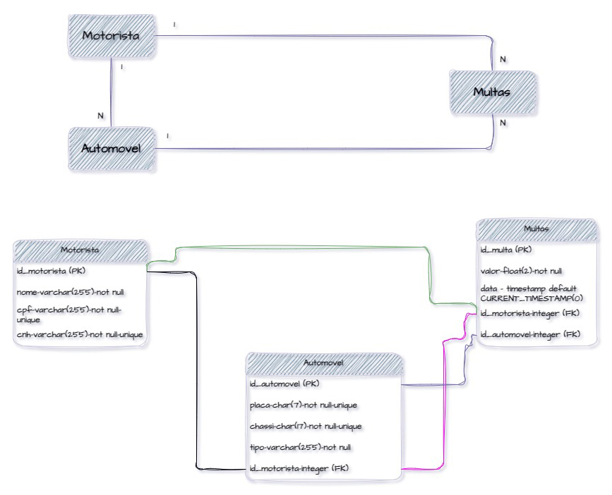

##  Sistema de Gerenciamento de Trânsito 🚦 

  Aplicação de gerenciamento com integração à um banco de dados
relacional.
  

<strong>Desenvolvedores:</strong> 
João Victor Sena Miranda da Costa 
Bruno Vieira Santana
  

## 💻 Instalação

Bibliotecas para interface gráfica 
import customtkinter 
import tkinter.ttk as ttk 
import tkinter 
import re 
from tkinter import * 
from ttkwidgets.autocomplete import AutocompleteEntry 
from CTkMessagebox import CTkMessagebox 

Bibliotecas para importação de imagens 
import os 
from PIL import Image 

Bibliotecas para gráficos 
import matplotlib.pyplot as plt 
from matplotlib.backends.backend_tkagg import FigureCanvasTkAgg 

